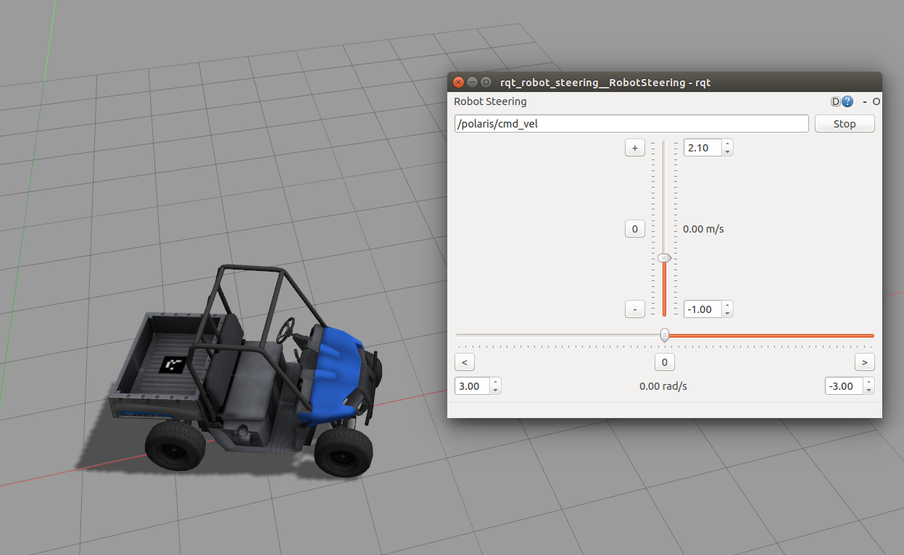

# Polaris Standalone Package
## System Requirements
- Ubuntu 14.04
- ROS Indigo/Jade (tested)
- Gazebo 6

## Running Process
- Git this repositories in your ros workspace
```
git clone https://github.com/weiweikong/polaris_simulation_standalone.git
```
- `catkin_make` it.
- Launch the Polaris
```
roslaunch roslaunch polaris_simple_control_plugin empty_world.launch
```
- Control the Polaris
```
rosrun rqt_robot_steering rqt_robot_steering
```
The control nodes is `/polaris/cmd_vel`
